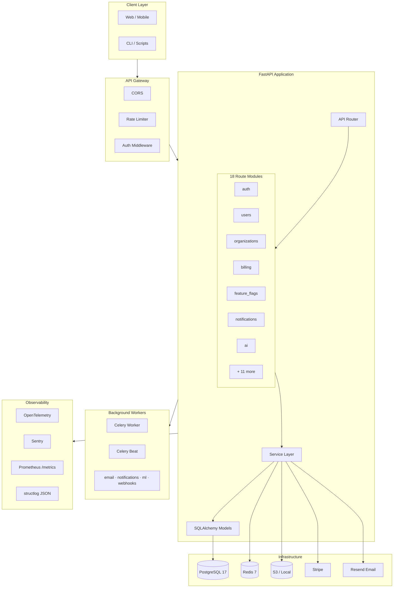
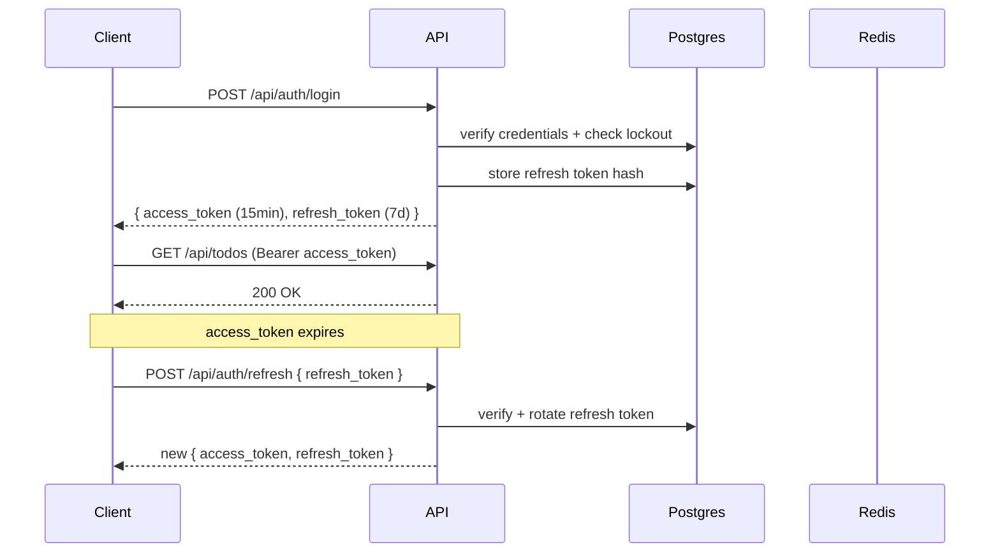
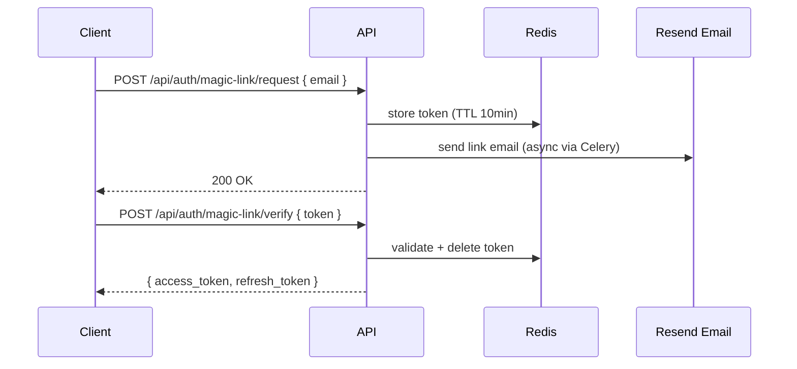
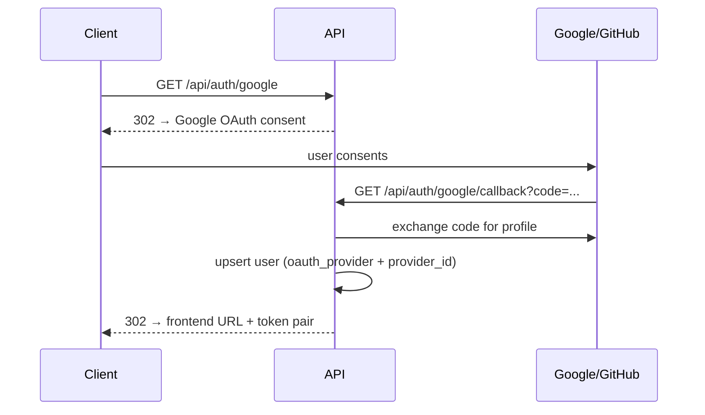

# FastAPI Boilerplate

Production-ready FastAPI + PostgreSQL backend. Async-first, batteries included — auth, billing, background jobs, observability, and a full test suite ready to ship.

[](https://www.python.org/downloads/)
[](https://fastapi.tiangolo.com)
[](https://docs.sqlalchemy.org/)
[](https://github.com/astral-sh/uv)
[](https://github.com/astral-sh/ruff)

---

## Architecture



---

## Tech Stack

| Layer | Choice |
|---|---|
| Framework | **FastAPI** + Uvicorn (ASGI) |
| ORM | **SQLAlchemy 2** async + Alembic |
| Database | **PostgreSQL 17** via asyncpg |
| Cache / Queue | **Redis 7** (asyncio) |
| Task Queue | **Celery** + Redis broker |
| Auth | JWT + bcrypt + TOTP + OAuth2 + WebAuthn |
| Payments | **Stripe** (checkout, portal, webhooks) |
| Email | **Resend** |
| File Storage | **Local / S3** (configurable) |
| AI | Anthropic + OpenAI clients |
| Observability | OpenTelemetry + Sentry + Prometheus |
| Logging | **structlog** (JSON in production) |
| Admin | **SQLAdmin** at `/admin` |
| Package Manager | **uv** |
| Linting | **Ruff** (strict, 11 rule categories) |
| Type Checking | **mypy** (strict) |

---

## Features

| Category | Feature |
|---|---|
| **Auth** | Email/password, JWT access + refresh (rotation), OTP, magic link, TOTP (authenticator app) |
| **Auth** | Google + GitHub OAuth2, WebAuthn / passkeys, API key auth |
| **Auth** | Account lockout (brute-force), per-endpoint rate limiting |
| **Access Control** | RBAC — user / admin / superuser roles |
| **Multi-tenancy** | Organizations + member roles (owner / admin / member) |
| **Payments** | Stripe checkout, billing portal, webhook handler, subscription tracking |
| **Background Jobs** | Celery workers + beat scheduler, job tracking API |
| **Notifications** | In-app notifications + async delivery queue |
| **Webhooks** | Outbound webhook delivery system |
| **Feature Flags** | Boolean, percentage rollout, A/B variants |
| **File Uploads** | Multipart upload, local or S3 storage |
| **Search** | Full-text cross-entity search |
| **Audit** | Append-only audit log on all mutations |
| **AI/ML** | Anthropic + OpenAI clients, ML task queue |
| **Observability** | OTel traces, Sentry errors, Prometheus metrics, structured logs |
| **Admin** | SQLAdmin panel — auto-generated CRUD for all models |
| **WebSockets** | Real-time push via ConnectionManager |
| **Security** | Security headers (HSTS, CSP), GZip, CORS, parameterized queries |
| **Developer Experience** | Hot reload, factory-boy test fixtures, real-DB integration tests |

---

## Quick Start

```bash
# 1. Install
git clone <repo> && cd fastapi-boilerplate
make setup          # uv sync + copy .env.example → .env

# 2. Start infrastructure (Docker)
make up             # postgres + redis

# 3. Database
make migrate        # run Alembic migrations
make seed           # seed admin + sample data

# 4. Run
make dev
```

| URL | Description |
|---|---|
| `http://localhost:8000/api/` | REST API |
| `http://localhost:8000/docs` | Swagger UI (dev only) |
| `http://localhost:8000/redoc` | ReDoc |
| `http://localhost:8000/admin` | SQLAdmin panel |
| `http://localhost:8000/metrics` | Prometheus metrics |

Or in one command:

```bash
make quickstart     # setup + up + migrate + seed
```

---

## Project Structure

```
app/
├── main.py                    # FastAPI factory — middleware, events, OTel, Sentry
├── config/
│   ├── settings.py            # Pydantic Settings (env-driven, validated at boot)
│   └── database.py            # Async SQLAlchemy engine + session factory
├── models/
│   └── base.py                # BaseModel (UUID PK + timestamps), SoftDeleteMixin
├── core/
│   ├── exceptions/            # AppError hierarchy + exception handlers
│   ├── middleware/            # RequestID, Logging, SecurityHeaders, RateLimit, Envelope
│   ├── pagination/            # Page-based pagination schemas
│   ├── rate_limit.py          # slowapi limiter config
│   └── security/              # JWT (create/decode), password hash/verify
├── services/
│   ├── base.py                # Generic CRUDService[Model, Create, Update]
│   ├── cache.py               # Redis CacheService
│   ├── email.py               # Resend EmailService
│   ├── storage.py             # Local/S3 StorageService
│   └── ai/                    # Anthropic + OpenAI clients
├── api/
│   ├── router.py              # Top-level APIRouter — aggregates all 18 modules
│   ├── auth/                  # register, login, refresh, OTP, TOTP, magic link, WebAuthn
│   ├── users/                 # profile CRUD, API key management
│   ├── organizations/         # orgs + membership
│   ├── todos/                 # CRUD, search, stats, bulk ops (reference module)
│   ├── billing/               # Stripe checkout, portal, webhooks
│   ├── notifications/         # in-app notifications
│   ├── audit/                 # read-only audit log
│   ├── feature_flags/         # boolean, percentage, A/B flags
│   ├── api_keys/              # API key CRUD
│   ├── files/                 # multipart upload, serve, delete
│   ├── jobs/                  # background job tracking
│   ├── webhooks/              # outbound webhook delivery
│   ├── search/                # full-text search
│   ├── health/                # /live, /ready, /info
│   ├── ai/                    # AI/ML endpoints
│   └── ws/                    # WebSocket endpoint + ConnectionManager
├── admin/                     # SQLAdmin views + auth
└── workers/
    ├── celery_app.py          # Celery app + beat schedule
    └── tasks/
        ├── email.py           # email delivery tasks
        ├── notifications.py   # notification delivery tasks
        ├── maintenance.py     # token cleanup, audit purge (scheduled)
        ├── ml.py              # AI/ML processing tasks
        └── webhooks.py        # webhook delivery queue

migrations/                    # Alembic versions (timestamp-named)
tests/
├── conftest.py                # fixtures: db, client, user, admin, auth_headers
├── factories/                 # factory_boy factories for all models
├── unit/                      # fast, isolated
├── integration/               # real DB (NullPool), one per module
└── e2e/                       # full user journey tests
scripts/
├── seed_data.py               # dev data: admin + users + todos + orgs
├── create_superuser.py        # provision initial superuser
├── generate_module.py         # scaffold a new API module (5-file pattern)
├── setup.sh                   # env setup helper
└── doctor.sh                  # dev environment validator
```

---

## API Reference

### Auth `/api/auth`

| Method | Path | Auth | Description |
|---|---|---|---|
| POST | `/register` | — | Register with email + password |
| POST | `/login` | — | Returns access + refresh token pair |
| POST | `/refresh` | — | Rotate token pair (single-use refresh) |
| POST | `/logout` | JWT | Revoke refresh token |
| GET | `/me` | JWT | Current user profile |
| POST | `/forgot-password` | — | Send password reset OTP |
| POST | `/reset-password` | — | Reset with OTP code |
| POST | `/change-password` | JWT | Authenticated password change |
| POST | `/request-otp` | — | Request OTP (any purpose) |
| POST | `/verify-otp` | — | Verify OTP code |
| POST | `/magic-link/request` | — | Send magic link email |
| POST | `/magic-link/verify` | — | Authenticate via token |
| GET | `/google` | — | Google OAuth2 redirect |
| GET | `/google/callback` | — | Google OAuth2 callback |
| GET | `/github` | — | GitHub OAuth2 redirect |
| GET | `/github/callback` | — | GitHub OAuth2 callback |
| POST | `/totp/setup` | JWT | Generate TOTP secret + QR code |
| POST | `/totp/verify` | JWT | Enable TOTP (verify first code) |
| POST | `/webauthn/register/begin` | JWT | Begin passkey registration |
| POST | `/webauthn/register/complete` | JWT | Complete passkey registration |
| POST | `/webauthn/authenticate/begin` | — | Begin passkey authentication |
| POST | `/webauthn/authenticate/complete` | — | Complete passkey authentication |
| GET | `/webauthn/credentials` | JWT | List registered passkeys |

### Users `/api/users`

| Method | Path | Auth | Description |
|---|---|---|---|
| GET | `/me` | JWT | Get own profile |
| PATCH | `/me` | JWT | Update own profile |
| DELETE | `/me` | JWT | Soft-delete own account |
| POST | `/me/api-keys` | JWT | Create API key |
| GET | `/me/api-keys` | JWT | List own API keys |
| DELETE | `/me/api-keys/:id` | JWT | Revoke API key |
| GET | `/` | Admin | List all users (paginated) |
| GET | `/:id` | Admin | Get user by ID |
| PATCH | `/:id` | Admin | Update user |
| DELETE | `/:id` | Admin | Soft-delete user |

### Organizations `/api/organizations`

| Method | Path | Auth | Description |
|---|---|---|---|
| POST | `/` | JWT | Create organization |
| GET | `/` | JWT | List own organizations |
| GET | `/:id` | Member | Get organization |
| PATCH | `/:id` | Org Admin | Update organization |
| DELETE | `/:id` | Owner | Delete organization |
| GET | `/:id/members` | Member | List members |
| POST | `/:id/members` | Org Admin | Add member |
| DELETE | `/:id/members/:uid` | Org Admin | Remove member |

### Todos `/api/todos` (reference CRUD module)

| Method | Path | Auth | Description |
|---|---|---|---|
| GET | `/` | JWT | List with filters + pagination |
| POST | `/` | JWT | Create |
| GET | `/stats` | JWT | Aggregated stats (total, done, overdue, by priority) |
| GET | `/:id` | JWT | Get by ID |
| PATCH | `/:id` | JWT | Update |
| DELETE | `/:id` | JWT | Soft delete |
| POST | `/:id/toggle` | JWT | Toggle completion |
| PATCH | `/bulk` | JWT | Bulk update by IDs |
| POST | `/bulk-delete` | JWT | Bulk delete by IDs |

Query params: `search`, `priority` (low/medium/high), `completed`, `overdue`, `due_today`, `page`, `limit`

### Billing `/api/billing`

| Method | Path | Auth | Description |
|---|---|---|---|
| POST | `/checkout` | JWT | Create Stripe checkout session |
| POST | `/portal` | JWT | Create Stripe billing portal |
| POST | `/webhook` | — | Stripe signed webhook handler |
| GET | `/subscription` | JWT | Get active subscription |
| DELETE | `/subscription` | JWT | Cancel subscription |

### System

| Method | Path | Auth | Description |
|---|---|---|---|
| GET | `/api/health/live` | — | Liveness probe |
| GET | `/api/health/ready` | — | Readiness probe (DB + Redis) |
| GET | `/api/health/info` | — | App version + environment |
| GET | `/metrics` | — | Prometheus metrics |
| GET | `/docs` | — | Swagger UI (dev only) |
| GET | `/admin` | Admin | SQLAdmin panel |

---

## Authentication Flows

### JWT Flow



### Magic Link / OTP Flow



### OAuth2 Flow



---

## Development

```bash
make dev              # hot reload dev server
make lint             # ruff check
make lint-fix         # ruff check --fix
make format           # ruff format
make typecheck        # mypy
make test             # all tests
make test-unit        # unit tests only
make test-integration # integration (needs DB)
make test-e2e         # end-to-end flows
make test-cov         # HTML coverage → htmlcov/
```

### Database

```bash
make migrate                       # apply pending migrations
make migration msg="add x table"   # generate new migration
make migrate-down                  # rollback one step
make seed                          # load dev data
make db-reset                      # drop + recreate + migrate (dev only)
```

Seed accounts (all use `password123`):

| Email | Role |
|---|---|
| `admin@example.com` | superuser |
| `alice@example.com` | user |
| `bob@example.com` | user |
| `charlie@example.com` | user |

### Adding a Module

```bash
uv run python scripts/generate_module.py myfeature
```

Scaffolds `app/api/myfeature/` with `model.py`, `schemas.py`, `service.py`, `router.py`, `__init__.py`. See [FEATURE_GENERATION.md](FEATURE_GENERATION.md) for the full workflow.

---

## Environment Variables

| Variable | Default | Description |
|---|---|---|
| `APP_ENV` | `development` | `development` / `production` / `test` |
| `SECRET_KEY` | — | Min 32 chars, required |
| `JWT_SECRET_KEY` | — | Min 32 chars, required |
| `JWT_ACCESS_TOKEN_EXPIRE_MINUTES` | `15` | Access token TTL |
| `JWT_REFRESH_TOKEN_EXPIRE_DAYS` | `7` | Refresh token TTL |
| `DATABASE_URL` | `postgresql+asyncpg://...` | Async Postgres URL |
| `DATABASE_POOL_SIZE` | `20` | SQLAlchemy pool size |
| `REDIS_URL` | `redis://localhost:6379/0` | Redis connection |
| `RESEND_API_KEY` | `""` | Email delivery |
| `GOOGLE_CLIENT_ID` | `""` | Google OAuth |
| `GITHUB_CLIENT_ID` | `""` | GitHub OAuth |
| `STRIPE_API_KEY` | `""` | Stripe payments |
| `STRIPE_WEBHOOK_SECRET` | `""` | Webhook signature verification |
| `ANTHROPIC_API_KEY` | `""` | Claude AI |
| `OPENAI_API_KEY` | `""` | OpenAI |
| `OTEL_ENABLED` | `false` | OpenTelemetry tracing |
| `SENTRY_DSN` | `""` | Sentry error tracking |
| `PROMETHEUS_ENABLED` | `true` | Prometheus `/metrics` |
| `STORAGE_DRIVER` | `local` | `local` or `s3` |
| `UPLOAD_MAX_SIZE_MB` | `50` | Max upload size |
| `WEBAUTHN_RP_ID` | `localhost` | Relying party domain |
| `RATE_LIMIT_DEFAULT` | `100/minute` | Global rate limit |

Full reference: [`.env.example`](.env.example)

---

## Docker

```bash
make up                # postgres + redis + api
make up-celery         # + Celery worker
make up-monitoring     # + Celery worker + Flower
make down
make logs
make ps
```

Production image:

```bash
docker build -t my-api .
docker run -p 8000:8000 --env-file .env.prod my-api
```

In `production` mode: Swagger/ReDoc disabled, JSON logging, debug off, secret key validation enforced.

---

## Testing

Tests use **real database** (NullPool — no mocked ORM). Factories via `factory_boy`.

```bash
make test                # all tests
make test-unit           # fast, isolated
make test-integration    # hit real Postgres + Redis
make test-e2e            # full user journeys
make test-cov            # HTML report → htmlcov/index.html
```

Test markers: `unit`, `integration`, `e2e`, `slow`, `smoke`, `ml`

```bash
uv run pytest -m unit
uv run pytest -m "integration and not slow"
```

---

## Security

- `SECRET_KEY` min 32 chars — validated at boot in production
- `JWT_SECRET_KEY` separate from `SECRET_KEY`
- Passwords hashed with **bcrypt**
- Refresh tokens **hashed** before storage (SHA-256)
- Account **lockout** after 5 failed attempts (15-min window)
- Rate limiting on all auth endpoints
- CORS configured via `CORS_ORIGINS`
- **Security headers** on all responses (HSTS, CSP, X-Frame-Options)
- API keys hashed before storage
- SQL injection prevented via SQLAlchemy parameterized queries
- File uploads capped at `UPLOAD_MAX_SIZE_MB`
- Stripe webhook **signature verified** on every event

---

## Performance

- **asyncpg** driver — async I/O, no thread-pool blocking
- **orjson** default response class — ~2× faster JSON serialization
- **GZip** middleware — ~70% size reduction on JSON responses
- **structlog** JSON renderer — machine-parseable in production
- **Redis** for cache, OTP, lockout — avoids extra DB round-trips
- Connection pool: `POOL_SIZE=20`, `MAX_OVERFLOW=40`

---

## Further Reading

| Doc | Contents |
|---|---|
| [docs/ARCHITECTURE.md](docs/ARCHITECTURE.md) | System diagrams, middleware stack, data model, service layer |
| [docs/AUTH.md](docs/AUTH.md) | All auth flows with sequence diagrams, RBAC reference |
| [docs/DEPLOYMENT.md](docs/DEPLOYMENT.md) | Production deployment, health checks, monitoring |
| [FEATURE_GENERATION.md](FEATURE_GENERATION.md) | How to scaffold a new API module |
| [.env.example](.env.example) | All environment variables with descriptions |
