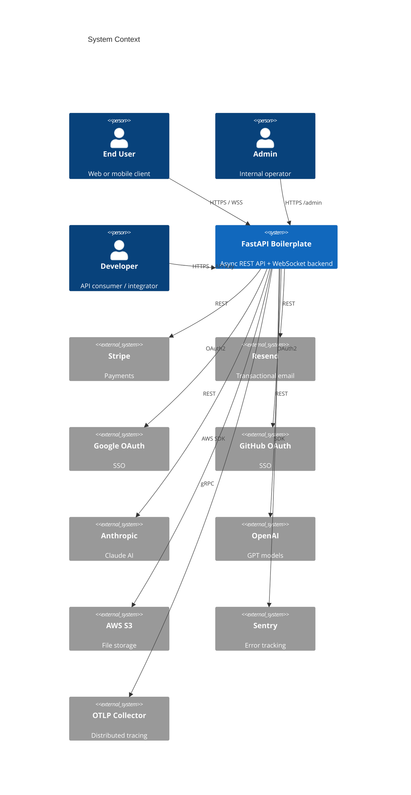
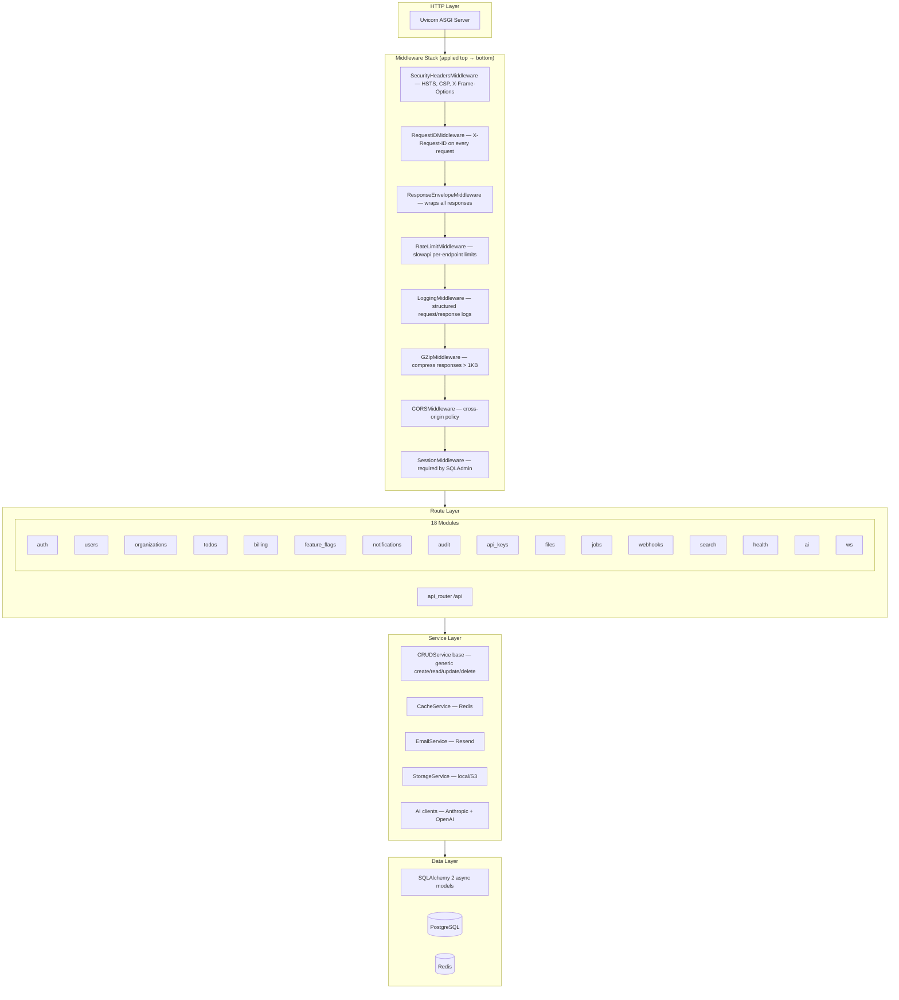
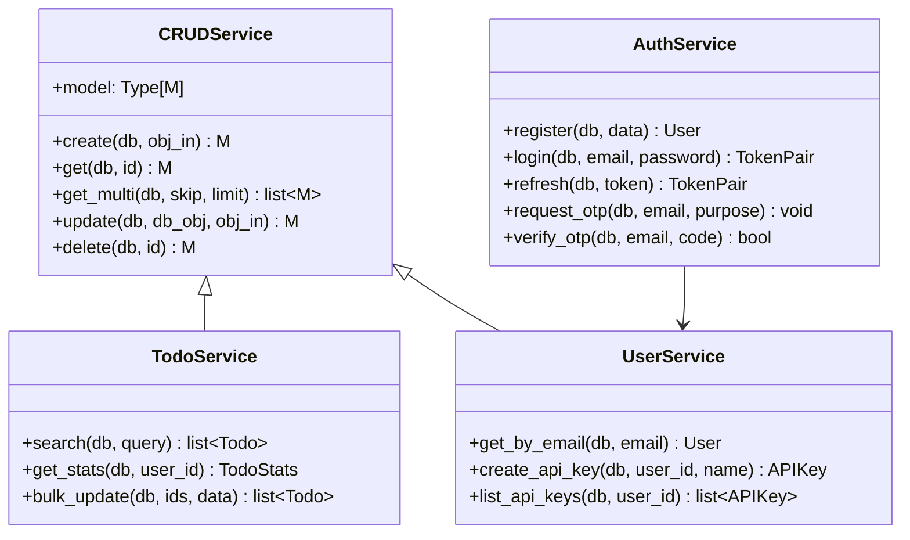
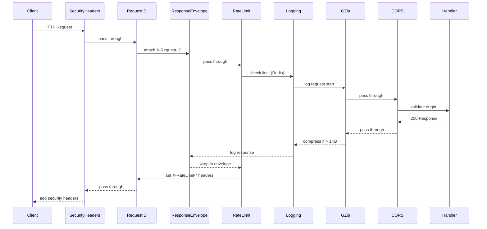
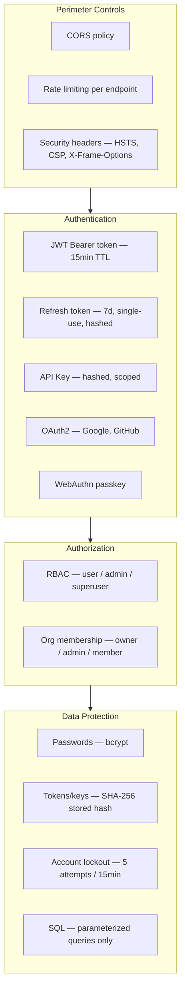
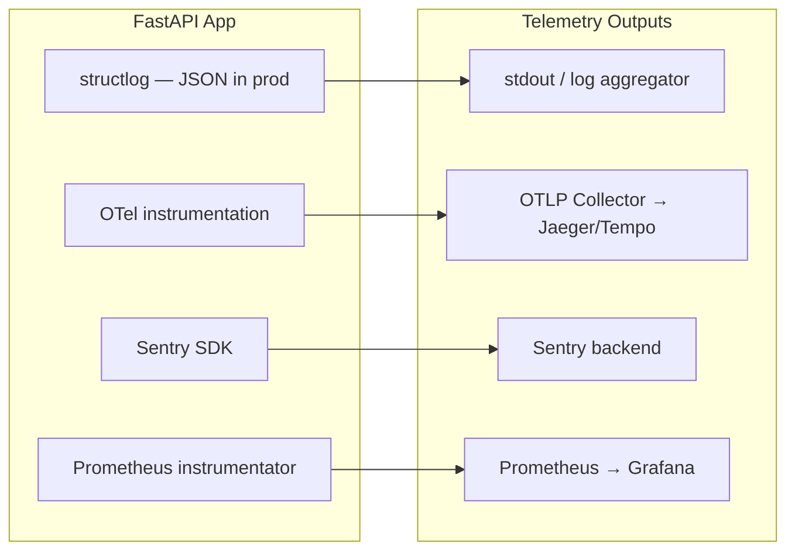

# Architecture

Technical deep-dive into the FastAPI Boilerplate system design.

---

## System Context



---

## Application Layers



---

## Module Structure

Every API module follows the same 5-file pattern:

```
app/api/<module>/
├── __init__.py     — public exports
├── model.py        — SQLAlchemy ORM model(s)
├── schemas.py      — Pydantic request/response models
├── service.py      — business logic (extends CRUDService)
└── router.py       — FastAPI endpoints
```



---

## Data Model

```mermaid
erDiagram
    User {
        uuid id PK
        string email UK
        string password_hash
        string role
        bool is_active
        bool is_verified
        bool totp_enabled
        string oauth_provider
        string oauth_provider_id
        datetime deleted_at
        datetime created_at
    }

    RefreshToken {
        uuid id PK
        uuid user_id FK
        string token_hash UK
        datetime expires_at
        bool revoked
    }

    OTP {
        uuid id PK
        uuid user_id FK
        string code_hash
        string purpose
        datetime expires_at
        bool used
    }

    WebAuthnCredential {
        uuid id PK
        uuid user_id FK
        string credential_id UK
        bytes public_key
        int sign_count
        string device_name
        bool backup_eligible
    }

    APIKey {
        uuid id PK
        uuid user_id FK
        string key_hash UK
        string name
        datetime last_used_at
        datetime expires_at
    }

    Organization {
        uuid id PK
        uuid owner_id FK
        string name
        string slug UK
        datetime deleted_at
    }

    OrganizationMember {
        uuid id PK
        uuid org_id FK
        uuid user_id FK
        string role
    }

    FeatureFlag {
        uuid id PK
        string key UK
        string type
        bool enabled
        float percentage
        json variants
    }

    BillingCustomer {
        uuid id PK
        uuid user_id FK
        string stripe_customer_id UK
    }

    Subscription {
        uuid id PK
        uuid user_id FK
        string stripe_subscription_id UK
        string status
        string price_id
        datetime current_period_end
    }

    AuditLog {
        uuid id PK
        uuid user_id FK
        string action
        string resource_type
        uuid resource_id
        json changes
        string ip_address
    }

    Notification {
        uuid id PK
        uuid user_id FK
        string title
        string body
        bool read
        string type
    }

    WebhookEvent {
        uuid id PK
        string event_type
        string url
        json payload
        string status
        int attempt_count
    }

    Job {
        uuid id PK
        uuid user_id FK
        string task_name
        string status
        json result
        string error
    }

    User ||--o{ RefreshToken : has
    User ||--o{ OTP : has
    User ||--o{ WebAuthnCredential : has
    User ||--o{ APIKey : has
    User ||--o{ OrganizationMember : belongs_to
    User ||--o{ Notification : receives
    User ||--o{ AuditLog : generates
    User ||--|| BillingCustomer : has
    User ||--o{ Subscription : has
    Organization ||--o{ OrganizationMember : has
```



---

## Background Worker Architecture

```mermaid
graph LR
    subgraph App["FastAPI App"]
        ENDPOINT[API Endpoint]
        TASK[.delay() / .apply_async()]
    end

    subgraph Broker["Redis (db=1)"]
        QUEUE_EMAIL[email queue]
        QUEUE_NOTIF[notifications queue]
        QUEUE_ML[ml queue]
        QUEUE_HOOKS[webhooks queue]
        QUEUE_DEFAULT[default queue]
    end

    subgraph Worker["Celery Worker"]
        EMAIL_TASK[send_email]
        NOTIF_TASK[deliver_notification]
        ML_TASK[run_ml_task]
        HOOK_TASK[deliver_webhook]
    end

    subgraph Beat["Celery Beat (scheduled)"]
        CLEANUP[cleanup_expired_tokens — hourly]
        PURGE[purge_old_audit_logs — daily]
        KEY_EXP[expire_api_keys — hourly]
    end

    subgraph Results["Redis (db=2)"]
        RESULT[task results]
    end

    ENDPOINT --> TASK
    TASK --> QUEUE_EMAIL
    TASK --> QUEUE_NOTIF
    TASK --> QUEUE_ML
    TASK --> QUEUE_HOOKS
    QUEUE_EMAIL --> EMAIL_TASK
    QUEUE_NOTIF --> NOTIF_TASK
    QUEUE_ML --> ML_TASK
    QUEUE_HOOKS --> HOOK_TASK
    Beat --> QUEUE_DEFAULT
    Worker --> RESULT
```

---

## Middleware Request Lifecycle



---

## Security Architecture



---

## Observability Stack



Every request gets:
- `X-Request-ID` header (generated by `RequestIDMiddleware`)
- Structured log entry with `request_id`, `method`, `path`, `status_code`, `duration_ms`
- OTel span (if `OTEL_ENABLED=true`)
- Prometheus histogram entry (`http_request_duration_seconds`)
