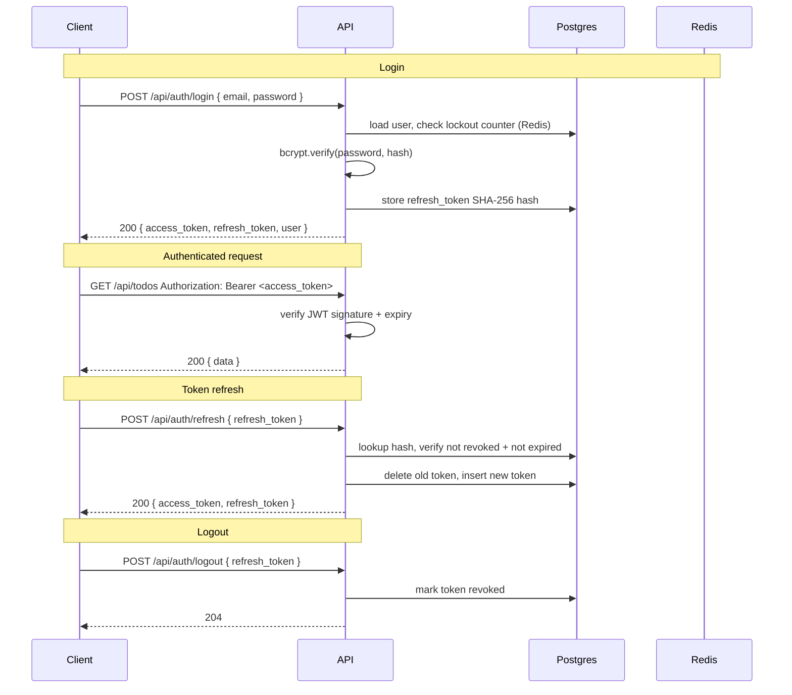
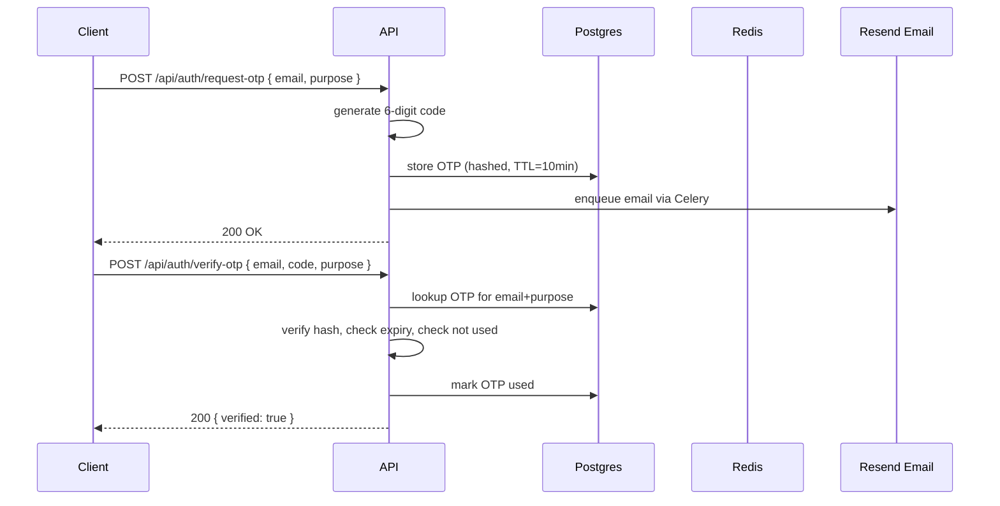
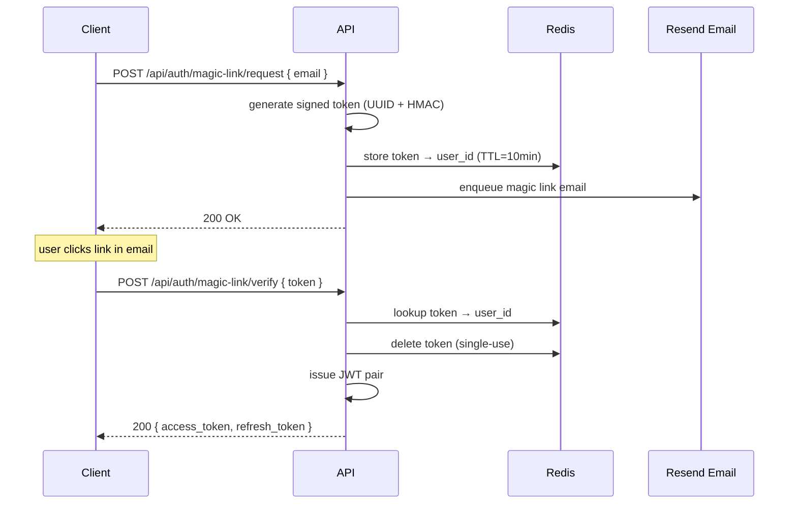
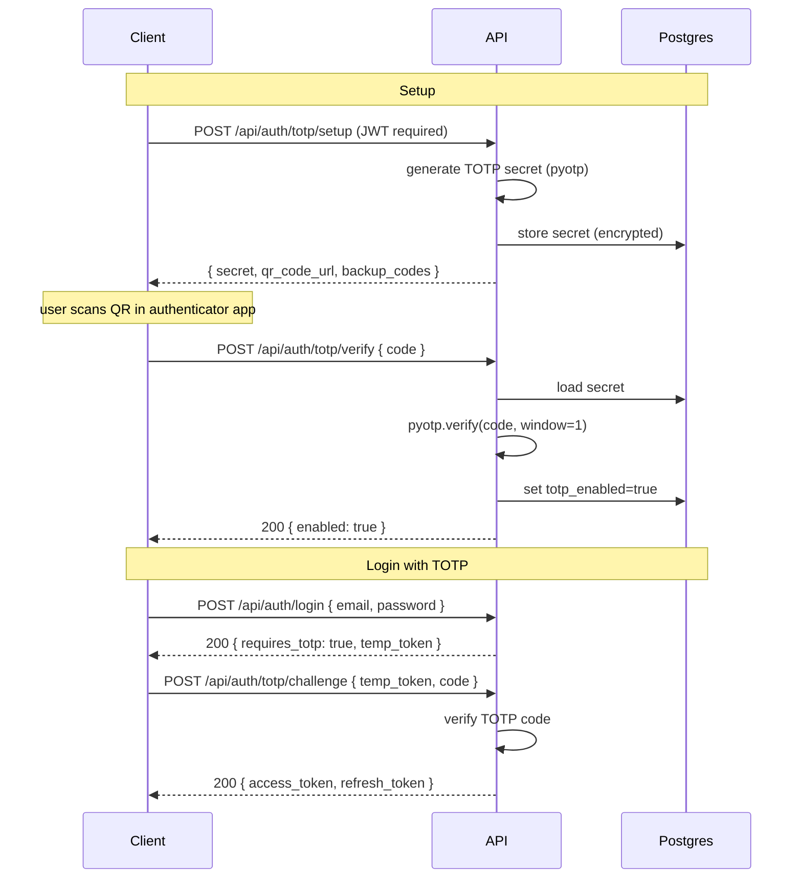
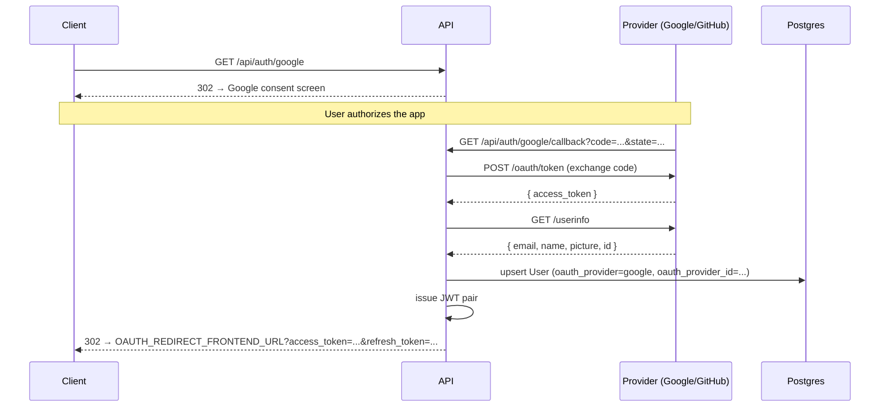
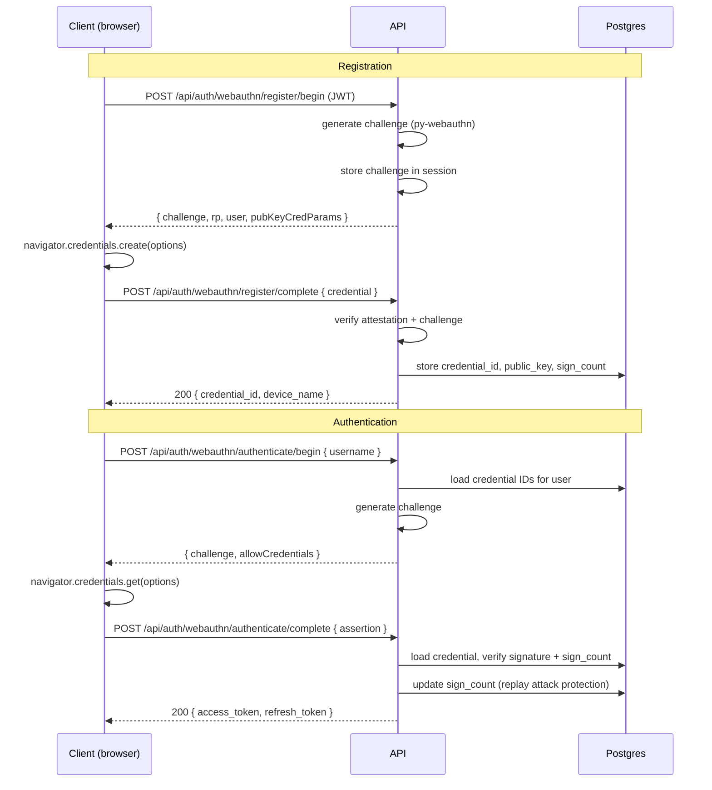
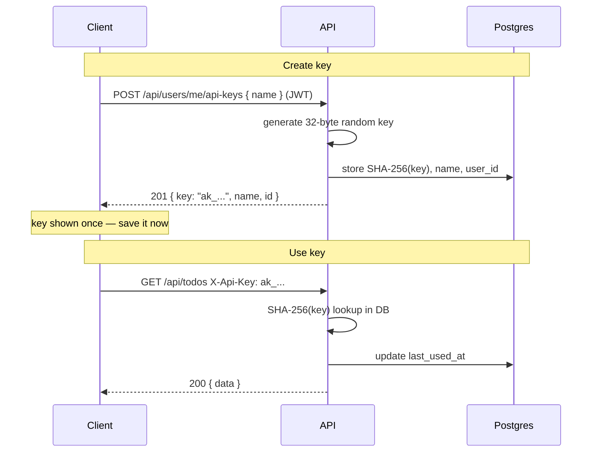
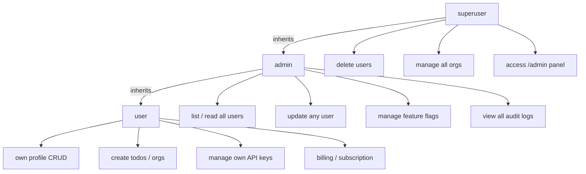
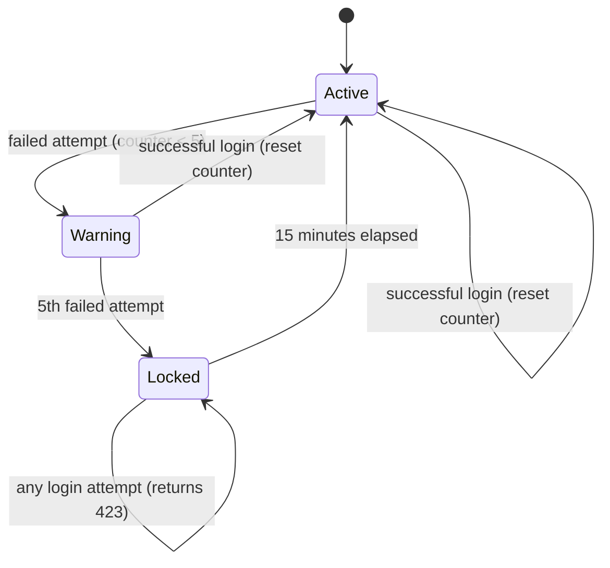
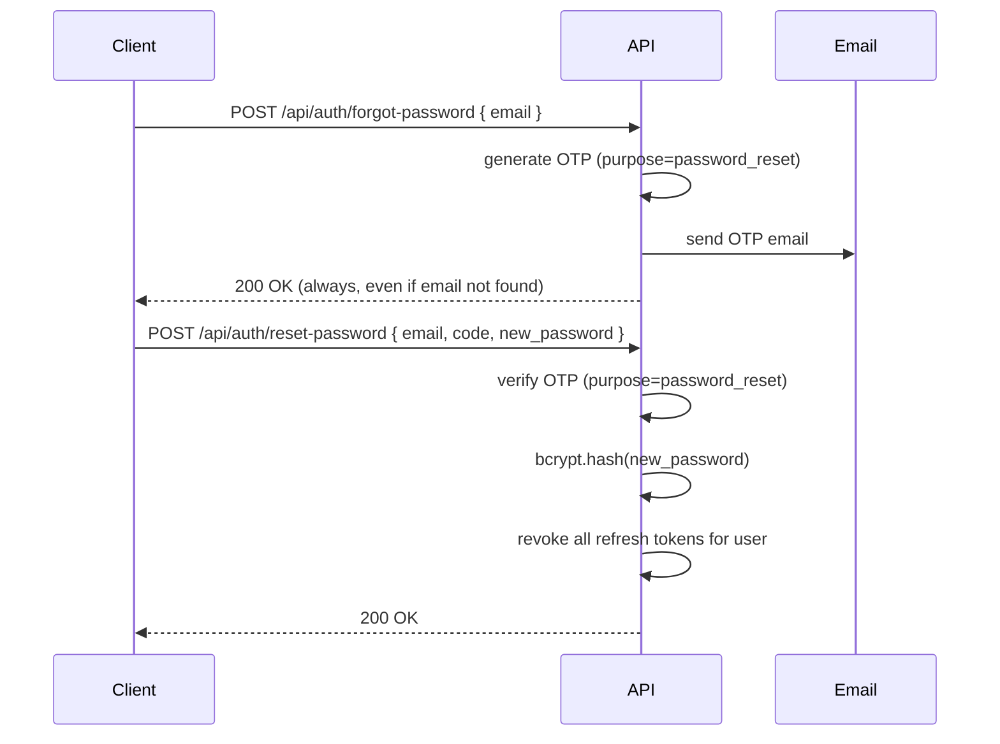

# Authentication & Authorization

Complete reference for all authentication methods and authorization patterns.

---

## Auth Methods at a Glance

| Method | Use Case | Token Type |
|---|---|---|
| Email + Password | Standard login | JWT pair |
| Refresh Token | Extend session | Rotated JWT pair |
| OTP (email code) | Verification, 2FA, password reset | One-time code |
| Magic Link | Passwordless login | Signed token |
| TOTP | Authenticator app 2FA | 6-digit TOTP |
| Google OAuth2 | Social login | JWT pair |
| GitHub OAuth2 | Social login | JWT pair |
| WebAuthn / Passkey | Biometric / hardware key | JWT pair |
| API Key | Service-to-service | Static key |

---

## JWT Token Flow

Access tokens live 15 minutes. Refresh tokens rotate on every use (single-use, stored as SHA-256 hash).



Token payload:

```json
{
  "sub": "<user-uuid>",
  "role": "user",
  "exp": 1234567890,
  "iat": 1234567890,
  "jti": "<uuid>"
}
```

---

## OTP Flow

Used for email verification, password reset, and 2FA challenges.



OTP purposes: `email_verification` · `password_reset` · `two_factor` · `magic_link`

---

## Magic Link Flow

Passwordless authentication via a signed, single-use token.



---

## TOTP (Authenticator App)

Standard TOTP (RFC 6238). Compatible with Google Authenticator, Authy, 1Password, etc.



---

## OAuth2 Flow



Provider fields stored on `User`:
- `oauth_provider` — `google` | `github`
- `oauth_provider_id` — provider's user ID

---

## WebAuthn / Passkeys

Biometric or hardware-key authentication via FIDO2 / WebAuthn.



Config required:

```env
WEBAUTHN_RP_ID=yourdomain.com      # must match browser origin
WEBAUTHN_RP_NAME="My App"
WEBAUTHN_ORIGIN=https://yourdomain.com
```

---

## API Key Authentication

For service-to-service or CLI access. Keys are shown once on creation — only the SHA-256 hash is stored.



---

## Role-Based Access Control

Three built-in roles on the `User` model:



Organization-level roles (per `OrganizationMember.role`):

| Role | Permissions |
|---|---|
| `owner` | All org ops including delete |
| `admin` | Add/remove members, update org |
| `member` | Read org and member list |

### Dependency Usage

```python
from app.api.auth.dependencies import CurrentUser, AdminUser, SuperUser

@router.get("/")
async def list_users(user: AdminUser) -> list[UserResponse]:
    ...

@router.delete("/:id")
async def delete_user(user: SuperUser) -> None:
    ...
```

---

## Account Lockout

After 5 consecutive failed login attempts, the account is locked for 15 minutes. Lockout state is tracked in Redis.



---

## Password Reset



The `200 OK` on forgot-password regardless of email existence prevents user enumeration.

---

## Response Format

All auth endpoints return a consistent envelope:

```json
{
  "data": {
    "access_token": "eyJ...",
    "refresh_token": "eyJ...",
    "token_type": "bearer",
    "user": {
      "id": "uuid",
      "email": "user@example.com",
      "role": "user",
      "is_verified": true
    }
  },
  "meta": {
    "request_id": "uuid",
    "timestamp": "2025-01-01T00:00:00Z"
  }
}
```

Error responses:

```json
{
  "error": {
    "code": "INVALID_CREDENTIALS",
    "message": "Invalid email or password",
    "status": 401
  }
}
```
